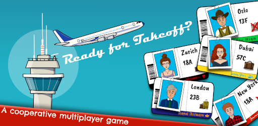
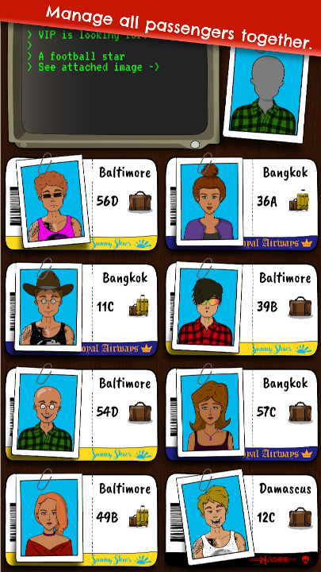

# Ready for Takeoff

Cooperative multiplayer game developed in Godot.
Send your passengers to the right destination!

Unique challenges to find passengers are only shown to a single player.
Offline communication (screaming at your friends) is required to find the passenger,
who might be on another players screen. Complete challenges in time to advance to the next level.

Check out the live version on [Google Play](https://play.google.com/store/apps/details?id=com.slingshotmedia.readyfortakeoff).

Developed by Simon Wüthrich (Art) & Oliver Dressler (Code).

## Implementation

Both server and client are implemented using Godot 3.5 stable.
Run local server or deploy dockerized version.
Even though a single player has to open a room and invite people, they are not actually hosting the game.
All communication still runs via the remote server.

## In-game View

